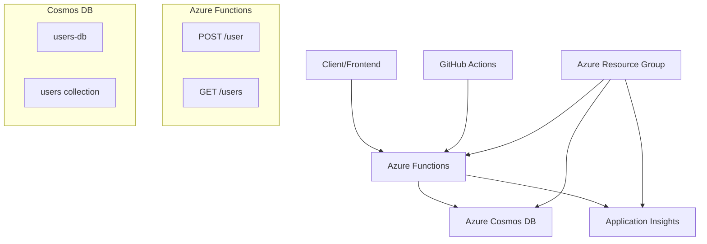

# Azure Serverless User Management System

[](https://github.com/ryanamir/cloud-project/actions/workflows/deploy.yml)

A modern, serverless cloud application built with Azure Functions and Cosmos DB that demonstrates cloud engineering best practices for 2025. This project showcases skills in serverless architecture, Infrastructure as Code (IaC), CI/CD pipelines, and cloud-native development.

## 🏗️ Architecture



## 🚀 Features

- **Serverless Architecture**: Azure Functions with HTTP triggers
- **NoSQL Database**: Azure Cosmos DB with automatic indexing
- **CI/CD Pipeline**: GitHub Actions for automated deployment
- **Infrastructure as Code**: Bicep templates for resource provisioning
- **Observability**: Application Insights integration with structured logging
- **Security**: Environment-based configuration, no hardcoded secrets
- **Frontend**: Optional lightweight HTML/JS interface

## 📊 API Reference

### POST /user
Store a new user in the database.

**Request:**
```json
{
  "name": "Ryan",
  "email": "r@xyz.com"
}
```

**Response:**
```json
{
  "id": "generated-uuid",
  "name": "Ryan", 
  "email": "r@xyz.com",
  "created_at": "2025-01-01T12:00:00Z"
}
```

### GET /users
Retrieve all users from the database.

**Response:**
```json
[
  {
    "id": "uuid-1",
    "name": "Ryan",
    "email": "r@xyz.com", 
    "created_at": "2025-01-01T12:00:00Z"
  }
]
```

## 🛠️ Technology Stack

- **Runtime**: Python 3.11
- **Serverless**: Azure Functions (v2)
- **Database**: Azure Cosmos DB (NoSQL API)
- **Monitoring**: Azure Application Insights
- **IaC**: Azure Bicep
- **CI/CD**: GitHub Actions
- **Frontend**: HTML/JavaScript (optional)

## 🚀 Quick Start

### Prerequisites
- Azure CLI installed and logged in
- Azure Functions Core Tools v4
- Python 3.11+
- Visual Studio Code with Azure Functions extension (recommended)

### Local Development

1. **Clone the repository**
   ```bash
   git clone https://github.com/yourusername/cloud-project.git
   cd cloud-project
   ```

2. **Set up local environment**
   ```bash
   python -m venv venv
   source venv/bin/activate  # On Windows: venv\Scripts\activate
   pip install -r requirements.txt
   ```

3. **Configure local settings**
   ```bash
   cp local.settings.json.example local.settings.json
   # Edit local.settings.json with your Cosmos DB connection string
   ```

4. **Run locally**
   ```bash
   func start
   ```

## ☁️ Deployment

### Option 1: Using Azure CLI (Recommended)

1. **Deploy infrastructure**
   ```bash
   az group create --name rg-userapp --location eastus
   az deployment group create \
     --resource-group rg-userapp \
     --template-file infrastructure/main.bicep \
     --parameters appName=userapp-$(date +%s)
   ```

2. **Deploy function app**
   ```bash
   func azure functionapp publish <your-function-app-name>
   ```

### Option 2: Using GitHub Actions

1. **Set up GitHub Secrets**
   - `AZURE_FUNCTIONAPP_PUBLISH_PROFILE`: Download from Azure Portal
   - `AZURE_CREDENTIALS`: Service principal for Bicep deployment

2. **Push to main branch**
   ```bash
   git push origin main
   ```

### Option 3: Using Visual Studio Code

1. Install Azure Functions extension
2. Sign in to Azure
3. Right-click on function_app folder → "Deploy to Function App"

## 🧪 Testing

### Using curl
```bash
# Create a user
curl -X POST https://your-function-app.azurewebsites.net/api/user \
  -H "Content-Type: application/json" \
  -d '{"name": "Ryan", "email": "r@xyz.com"}'

# Get all users  
curl https://your-function-app.azurewebsites.net/api/users
```

### Using Postman
Import the collection from `docs/postman_collection.json`

### Using the Frontend
Open `frontend/index.html` in your browser or deploy to GitHub Pages.

## 💰 Cost Estimate

This project is designed to run on Azure's free tier:

- **Azure Functions**: 1M requests/month free
- **Cosmos DB**: 1000 RU/s + 25GB storage free
- **Application Insights**: 5GB data ingestion/month free
- **Storage Account**: 5GB locally redundant storage free

**Total Monthly Cost: $0** (within free tier limits)

## 🔐 Security Best Practices

- ✅ No hardcoded secrets (environment variables only)
- ✅ HTTPS-only endpoints
- ✅ Input validation and sanitization
- ✅ Proper error handling without information disclosure
- ✅ Resource group isolation
- ✅ Managed identity for inter-service authentication

## 📈 Monitoring & Observability

- **Application Insights**: Real-time monitoring and analytics
- **Structured Logging**: JSON-formatted logs with correlation IDs
- **Health Checks**: Automated endpoint validation in CI/CD
- **Alerts**: Configured for function failures and high latency

## 📁 Project Structure

```
cloud-project/
├── function_app/                 # Azure Functions application
│   ├── user_create/             # POST /user endpoint
│   ├── user_list/               # GET /users endpoint
│   ├── host.json                # Function app configuration
│   └── local.settings.json      # Local development settings
├── infrastructure/              # Infrastructure as Code
│   ├── main.bicep              # Main Bicep template
│   └── modules/                # Bicep modules
├── .github/workflows/          # CI/CD pipeline
│   └── deploy.yml              # GitHub Actions workflow
├── frontend/                   # Optional frontend
│   ├── index.html              # User interface
│   └── app.js                  # JavaScript logic
├── docs/                       # Documentation
│   └── postman_collection.json # API testing collection
├── requirements.txt            # Python dependencies
└── README.md                   # This file
```

## 🏆 Skills Demonstrated

This project showcases key skills expected for Cloud Engineer Interns in 2025:

- **Serverless Architecture**: Building event-driven, scalable applications
- **Cloud-Native Development**: Azure Functions, Cosmos DB integration
- **Infrastructure as Code**: Bicep templates for reproducible deployments
- **CI/CD Pipelines**: Automated testing and deployment with GitHub Actions
- **Observability**: Application monitoring and structured logging
- **Security**: Secret management and secure coding practices
- **Documentation**: Clear, comprehensive project documentation

## 🤝 Contributing

1. Fork the repository
2. Create a feature branch (`git checkout -b feature/amazing-feature`)
3. Commit your changes (`git commit -m 'Add amazing feature'`)
4. Push to the branch (`git push origin feature/amazing-feature`)
5. Open a Pull Request

## 📄 License

This project is licensed under the MIT License - see the [LICENSE](LICENSE) file for details.

---

**Built with ❤️ for learning Azure cloud engineering** 