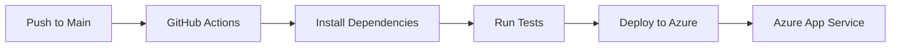

# Flask Azure DevOps Demo

A demonstration of CI/CD pipeline implementation using GitHub Actions and Azure App Service.

## Project Overview

This project showcases a simple Flask web application with automated deployment to Azure App Service using GitHub Actions. The application includes a home route and an API status endpoint.

## CI/CD Pipeline



## Tech Stack

- **Backend**: Python 3.11
- **Web Framework**: Flask 3.0.2
- **WSGI Server**: Gunicorn
- **Container**: Docker
- **CI/CD**: GitHub Actions
- **Cloud Platform**: Azure App Service
- **Testing**: Pytest

## Key Features

- Automated CI/CD pipeline
- Containerized application
- Unit tests
- Health check endpoint
- Environment-aware configuration

## Azure Resources Used

- Azure App Service
- Azure Container Registry (optional)

## Setup and Deployment Guide

### Prerequisites

- Python 3.11 or higher
- Docker
- Azure CLI
- GitHub account
- Azure subscription

### Local Development

1. Clone the repository:
   ```bash
   git clone <repository-url>
   cd <repository-name>
   ```

2. Create and activate virtual environment:
   ```bash
   python -m venv venv
   source venv/bin/activate  # On Windows: venv\Scripts\activate
   ```

3. Install dependencies:
   ```bash
   pip install -r requirements.txt
   ```

4. Run the application:
   ```bash
   python app.py
   ```

### Running with Docker

1. Build the Docker image:
   ```bash
   docker build -t flask-azure-demo .
   ```

2. Run the container:
   ```bash
   docker run -p 5000:5000 flask-azure-demo
   ```

### Manual Azure Deployment

1. Login to Azure:
   ```bash
   az login
   ```

2. Create a resource group:
   ```bash
   az group create --name myResourceGroup --location eastus
   ```

3. Create an App Service plan:
   ```bash
   az appservice plan create --name myAppServicePlan --resource-group myResourceGroup --sku B1 --is-linux
   ```

4. Create a web app:
   ```bash
   az webapp create --resource-group myResourceGroup --plan myAppServicePlan --name <app-name> --deployment-container-image-name <container-image-name>
   ```

### GitHub Actions Setup

1. Add the following secrets to your GitHub repository:
   - `AZURE_WEBAPP_NAME`: Your Azure App Service name
   - `AZURE_WEBAPP_PUBLISH_PROFILE`: Your Azure App Service publish profile

2. To get the publish profile:
   - Go to Azure Portal
   - Navigate to your App Service
   - Click on "Get publish profile"
   - Copy the contents and add as a secret

## API Endpoints

- `GET /`: Home page
- `GET /api/status`: Health check endpoint

## Contributing

1. Fork the repository
2. Create a feature branch
3. Commit your changes
4. Push to the branch
5. Create a Pull Request

## License

MIT License 